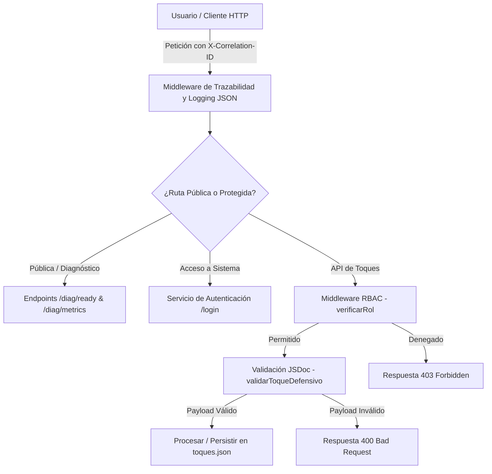

# Sistema Web - Banda de Guerra UNEFA (Núcleo Falcón)

Aplicación web para la gestión del repositorio musical de la Banda de Guerra de la UNEFA Nucleo Falcon, Sede Coro

---

## Tabla de Contenido
1. [Arquitectura del Sistema](#arquitectura-del-sistema)
2. [Requisitos Previos](#requisitos-previos)
3. [Instalación y Configuración Local](#instalación-y-configuración-local)
4. [Ejecución de Pruebas Unitarias](#ejecución-de-pruebas-unitarias)
5. [Ejecución con Docker](#ejecución-con-docker)
6. [Canalización de Integración y Despliegue](#canalización-de-integración-y-despliegue)
7. [Endpoints API y Diagnóstico](#endpoints-api-y-diagnóstico)
8. [Seguridad y Observabilidad](#seguridad-y-observabilidad)

---

## Arquitectura del Sistema

El sistema cuenta con un servidor backend desacoplado construido sobre **Node.js** y **Express**. Aplica validación estricta de esquemas (JSDoc), middleware para el control de acceso por roles (**RBAC**), inyección de identificadores únicos de trazabilidad (**Correlation ID**) y generación de logs estructurados en formato JSON.

### Diagrama de Arquitectura (Mermaid)



---

## Requisitos Previos

* **Node.js**: Versión 18 o superior (Recomendado v18 LTS o v24).
* **Git**: Para el control de versiones.
* **Docker & Docker Compose** *(Opcional)*: Para ejecución en entornos aislados y portables.

---

## Instalación y Configuración Local

1. **Clonar el repositorio:**
   ```bash
   git clone [https://github.com/kristian616/aplicacion.git](https://github.com/kristian616/aplicacion.git)
   cd aplicacion
   ```

2. **Instalar dependencias:**
   ```bash
   npm install
   ```

3. **Iniciar el servidor en modo desarrollo:**
   ```bash
   node server.js
   ```
   *El servidor se ejecutará por defecto en `http://localhost:3000`.*

---

## Ejecución de Pruebas Unitarias

La suite de pruebas automatizadas está configurada mediante **Jest** para evaluar la integridad del módulo `validarToqueDefensivo` y prevenir regresiones en la API.

Para ejecutar la suite de pruebas localmente:
```bash
npm test
```

---

## Ejecución con Docker

El proyecto incluye un entorno containerizado listo para producción mediante **Dockerfile** y **Docker Compose**.

1. **Construir y levantar los contenedores en segundo plano:**
   ```bash
   docker-compose up --build -d
   ```

2. **Verificar estado de los contenedores:**
   ```bash
   docker-compose ps
   ```

3. **Detener y limpiar los contenedores:**
   ```bash
   docker-compose down
   ```

---

## Canalización de Integración y Despliegue

El repositorio dispone de un flujo automatizado de Integración Continua definido en `.github/workflows/ci.yml`. En cada `push` o `pull request` hacia la rama `main`, la canalización ejecuta:
1. Descarga del entorno Node.js 18.
2. Instalación limpia de dependencias (`npm ci`).
3. Ejecución de la suite de pruebas unitarias (`npm test`).
4. Verificación de compilación de la imagen Docker.

---

## Endpoints API y Diagnóstico

| Método | Ruta | Descripción | Nivel de Acceso |
| :--- | :--- | :--- | :--- |
| **GET** | `/` | Retorna la pantalla principal de inicio de sesión (`login.html`). | Público |
| **POST** | `/login` | Procesamiento de credenciales de usuario. | Público |
| **GET** | `/diag/ready` | Verificación de disponibilidad operativa del servicio (*Health Check*). | Público |
| **GET** | `/diag/metrics` | Métricas en tiempo real (CPU, uso de memoria, *uptime* y *Correlation ID*). | Diagnóstico |
| **GET** | `/api/toques` | Consulta el catálogo completo de toques y partituras desde `toques.json`. | Autenticado |
| **POST** | `/api/toques` | Registro de un nuevo toque defensivo con validación de datos. | Requiere Rol `admin` |

---

## Seguridad y Observabilidad

1. **Logs Estructurados en JSON:** Todos los registros emitidos en consola incluyen `timestamp`, `level`, `service`, `context` y `correlationId`.
2. **Trazabilidad HTTP (Correlation ID):** Cada petición asigna o preserva el encabezado `X-Correlation-ID` mediante el módulo `crypto` de Node.js para rastreo *end-to-end*.
3. **Control de Acceso Basado en Roles (RBAC):** Restricción de endpoints mediante middleware de verificación de cabeceras de rol (`verificarRol`).
4. **Validación de Entradas:** Métodos de sanidad en JavaScript anotados bajo estándares **JSDoc** (`@param`, `@returns`).
